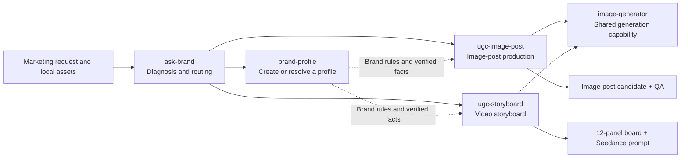

<p align="right">
  <strong>English</strong> · <a href="README.zh-CN.md">简体中文</a>
</p>

<p align="center">
  
</p>

# brand-ugc

Diagnose a brand marketing request from one entry point, then turn a benchmark
video or image post into brand-specific content.

This repository contains five composable Codex Skills:

- `ask-brand` diagnoses the request, checks assets, and routes one workflow.
- `brand-profile` maintains reusable local profiles for multiple brands and products.
- `ugc-image-post` creates Xiaohongshu-style image-post candidates, copy, previews, and QA.
- `ugc-storyboard` creates 12-panel video storyboards and Seedance prompts.
- `image-generator` is the shared EvoLink image-generation adapter.

> [!IMPORTANT]
> The image-post workflow creates publishable candidates but does not post them.
> The video workflow creates storyboards and prompts but does not render the final MP4.

## How it works

The suite separates deciding what to make, storing verified brand facts, producing
content, and calling image-generation services. You can start from one router or
invoke a production Skill directly when the target format is already clear.



| Type | Skill | When to use it |
| --- | --- | --- |
| Unified entry | `ask-brand` | The request or assets are unclear, or you need to choose image post versus video |
| Brand context | `brand-profile` | Create, update, or select reusable brand and product facts |
| Production entry | `ugc-image-post` | The request is clearly a benchmark image-post transfer |
| Production entry | `ugc-storyboard` | The request is clearly a benchmark video storyboard |
| Shared capability | `image-generator` | Called by production Skills; usually not invoked directly |

The operating rules are simple: choose one production path at a time, approve the
plan before paid generation, keep claims traceable, and save resumable state locally.

## Quickstart

### 1. Requirements

- [Codex](https://openai.com/codex/)
- Node.js and `npx`, required only for one-command installation
- Python 3.10 or newer
- Image posts: ImageMagick and a CJK font such as Noto Sans CJK SC
- Video: FFmpeg and FFprobe
- Online generation: an [EvoLink API Key](https://evolink.ai/dashboard/keys)

### 2. Install all Skills

```bash
npx -y skills@latest add haonan-c/brand-ugc \
  --skill ask-brand brand-profile ugc-image-post ugc-storyboard image-generator \
  --agent codex --global --yes
```

Fully restart Codex or open a new task, then verify:

```bash
npx -y skills@latest list --global --agent codex
```

### 3. Configure EvoLink

```bash
export EVOLINK_API_KEY="<YOUR_EVOLINK_KEY>"
```

Alternatively, save the key by itself at:

```text
Windows:      %USERPROFILE%\.agents\skills\image-generator\secrets\api_key.txt
macOS/Linux:  ~/.agents/skills/image-generator/secrets/api_key.txt
```

Never paste a real key into chat, screenshots, logs, or Git.

### 4. Start from the router

```text
Use $ask-brand to decide whether these launch assets should become an image post
or a short video first, then continue with the recommended workflow.

I uploaded:
1. Product images
2. Benchmark images and copy, if available
3. A benchmark video, if available
4. A brand profile, if available
```

You can invoke either production Skill directly when the desired format is clear.

## Recommended workflow

### First-time setup

1. Install all five Skills and verify the local dependencies for the intended path.
2. Configure an EvoLink API key; an offline image-post demo can run without one.
3. Optionally use `$brand-profile` to save voice, prohibited language, product facts, and evidence.
4. Prepare one task's assets. Do not mix image-post and video benchmarks in one production run.
5. Start from `$ask-brand` when the path is unclear, or invoke a production Skill directly.

### Every content run

1. **Diagnose:** confirm the format, brand or product, required assets, and missing input.
2. **Plan:** analyze the benchmark's method and create an original branded plan.
3. **Approve:** review structure, copy direction, and facts before paid generation.
4. **Produce:** generate and compose image-post pages or create the video storyboard.
5. **QA:** check facts, brand consistency, visual integrity, and set coherence; retry within limits.
6. **Deliver:** save candidates, structured data, previews, and QA locally.

An online image-post run moves through these states:

| State | Meaning | Next action |
| --- | --- | --- |
| `awaiting_approval` | The plan is saved and no generation API was called | Approve, then continue with `--approve --resume` |
| `awaiting_visual_qa` | Online generation and local composition are complete | Inspect every page and submit visual QA |
| `completed` | Visual QA passed and deliverables were collected | Use the files in `deliverables/` |

If a command returns an error, fix the input, dependency, or generation problem.
Resume the existing run only when its inputs have not changed; otherwise start a new run.

## Image-post workflow

Provide one ordered set of benchmark images, its copy, and a product image:

```text
Use $ugc-image-post to create a Xiaohongshu-style branded image-post candidate.

Transfer only the structure and creative method. Do not copy wording, people,
trademarks, watermarks, or platform UI. Create six 3:4 pages and three title
options by default. Show me the content plan before paid generation.
```

The workflow:

1. Analyzes the hook, page roles, narrative, hierarchy, and visual patterns.
2. Creates a 4–9 page plan, defaulting to six.
3. Waits for approval before image generation.
4. Generates text-free backgrounds and composes real product pixels, text, and logos locally.
5. Runs group QA, with at most two page retries and one retry per page.
6. Delivers individual pages, a preview, publish copy, structured content, and QA.

Online runs require a visual QA report before they are marked complete. All run data
lives under `.brand_ugc/<run-name>/`; final files are collected in `deliverables/`.

## Video workflow

Provide a benchmark video and product image:

```text
Use $ugc-storyboard to create a 15-second brand UGC storyboard.

Return a 2K 12-panel storyboard and the complete Seedance prompt. Do not add
unsupported claims, subtitles, watermarks, or platform UI.
```

The existing seven-stage workflow remains intact: video analysis, local frame
extraction, rewritten script, 12 image prompts, template storyboard, final storyboard,
and video prompt.

## Brand profiles

`brand-profile` stores voice, colors, fonts, logos, prohibited language, and verified
product claims under:

```text
.brand_ugc/brands/<brand-id>/profile.json
```

Multiple brands and products are supported. Task overrides do not silently rewrite
the saved profile. Every verified claim must include evidence.

## Inputs and outputs

| Path | Required input | Main output |
| --- | --- | --- |
| Image post | 1–9 benchmark images, benchmark copy, product image | 4–9 3:4 pages, three titles, copy, preview, JSON, QA |
| Video | Benchmark video, product image | 2K storyboard, Seedance prompt, 12 motion instructions, QA |
| Brand profile | Brand ID, brand name, products | Reusable `profile.json` and resolved task context |

Person images, brand profiles, and additional verified facts are optional.

## Privacy, cost, and quality

- Original video stays local; only a derived proxy and optional mono audio are analyzed remotely.
- Benchmark post images are not sent as online generation references; product references are sent only for interaction pages.
- Logs must not contain API keys, authorization headers, Base64, or temporary URLs.
- 2K is the default and is never silently downgraded.
- A six-page image post uses six base generations and at most two page retries.
- A video run is capped at the configured 14 model business requests.
- Missing product facts remain unverified; the workflows do not invent claims.

## Advanced CLI

Codex first creates a Schema-valid image-post plan, then runs:

```bash
python3 ~/.agents/skills/ugc-image-post/scripts/run_pipeline.py \
  --run-name "my-product-post" \
  --reference-image "/absolute/path/reference-01.png" \
  --reference-copy-file "/absolute/path/reference-copy.txt" \
  --product-image "/absolute/path/product.png" \
  --plan-file "/absolute/path/content-plan.json"
```

The first run waits for approval. Repeat it with `--approve --resume` after approval.

After online generation, Codex inspects every page and creates a visual QA file.
Repeat the same command with:

```text
--visual-qa-file "/absolute/path/visual-qa.json" --approve --resume
```

To recover an interrupted run, keep the same `--run-name` and original inputs, then
use `--resume`. Use a new run name when changing the benchmark, product, or content
plan so that two runs do not share state.

Video:

```bash
python3 ~/.agents/skills/ugc-storyboard/scripts/run_public_pipeline.py \
  --run-name "my-product-ugc" \
  --video "/absolute/path/reference.mp4" \
  --product-image "/absolute/path/product.png" \
  --brand-profile-file "/absolute/path/profile.json" \
  --brand-product-id "<product-id>" \
  --product-info "Verified product facts and restrictions" \
  --resolution "2K"
```

## Local data and deliverables

```text
.brand_ugc/
├── brands/<brand-id>/profile.json
├── drafts/<run-name>/content-plan.json
└── <run-name>/
    ├── inputs/          Pinned inputs and manifest
    ├── outputs/         Content plan and intermediate output
    ├── images/          Base, product, and composed images
    ├── state/           Run state and request budget
    └── deliverables/    Final images, copy, JSON, preview, and QA
```

Runs do not overwrite unrelated task directories by default. Share `deliverables/`
rather than publishing a whole run directory that may contain source assets, state,
or local secret paths.

## Troubleshooting

**Why did the first run create no images?**

Stopping at `awaiting_approval` is expected. The first run only pins inputs and
presents the content plan; paid requests begin after approval.

**Why are the images ready while the run is not complete?**

Online runs require group visual QA. At `awaiting_visual_qa`, ask Codex to inspect
the pages and resume with the QA file. Only a passing report reaches `completed`.

**Can I work without a brand profile?**

Yes. Brand details supplied in the task become temporary context and are not
silently written to a long-lived profile.

**Why does the workflow ask me to select a product?**

When a profile contains multiple products, a `product-id` is required to prevent
facts and assets from different products from being mixed.

**Why do Chinese characters render as boxes, or why does ImageMagick fail?**

Install Noto Sans CJK SC or another supported CJK font and verify `magick -version`.
For video-analysis failures, also verify `ffmpeg` and `ffprobe`.

**Can the workflow publish directly to Xiaohongshu or another platform?**

No. It produces candidates and QA only; account login, automated publishing, and
platform scraping are outside the current scope.

## Development

```bash
PYTHONPATH=. uv run --with pytest pytest -q
```

Repository layout:

```text
ask-brand/        Unified diagnosis and orchestration
brand-profile/    Multi-brand, multi-product profiles
ugc-image-post/   Planning, generation, composition, QA, and resume
ugc-storyboard/   Seven-stage video storyboard workflow
image-generator/  EvoLink image-generation adapter
tests/            Contract, CLI, resume, and offline end-to-end tests
examples/         Licensed or source-documented fixtures
docs/             API compatibility notes
```

## License

Original project code is available under the [MIT License](LICENSE). Adapted material
retains its upstream licenses; see
[`ugc-storyboard/THIRD_PARTY_NOTICES.md`](ugc-storyboard/THIRD_PARTY_NOTICES.md).
