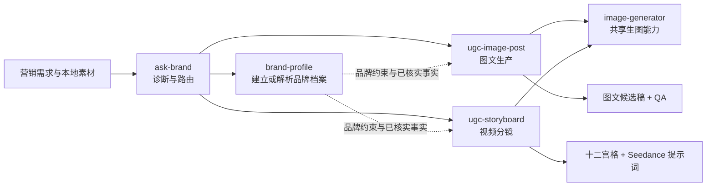

<p align="right">
  <a href="README.md">English</a> · <strong>简体中文</strong>
</p>

<p align="center">
  
</p>

# brand-ugc

从统一入口诊断品牌营销需求，把对标视频或对标图文迁移为品牌专属内容。

这个仓库包含五个可以组合安装的 Codex Skill：

- `ask-brand`：诊断需求、检查素材并路由到正确工作流。
- `brand-profile`：维护本地多品牌、多产品档案和已核实事实。
- `ugc-image-post`：生成小红书式多图候选稿、文案、预览和 QA。
- `ugc-storyboard`：生成十二宫格短视频分镜和 Seedance 提示词。
- `image-generator`：两个生产工作流共用的 EvoLink 生图适配器。

> [!IMPORTANT]
> 图文路径交付可发布候选稿，但不会自动发布。视频路径交付分镜图和提示词，不直接
> 渲染最终 MP4。

## 它如何工作

这套工具没有把所有职责塞进一个大 Skill，而是把“判断做什么”“保存品牌事实”
“生产内容”和“调用生图服务”分开。这样既可以从统一入口开始，也可以在目标明确时
直接调用生产 Skill。



| 类型 | Skill | 什么时候使用 |
| --- | --- | --- |
| 统一入口 | `ask-brand` | 需求还比较宽泛、素材不确定，或需要判断先做图文还是视频 |
| 品牌上下文 | `brand-profile` | 创建、更新或选择可复用的品牌与产品事实 |
| 生产入口 | `ugc-image-post` | 已明确要做对标图文迁移 |
| 生产入口 | `ugc-storyboard` | 已明确要做对标视频分镜 |
| 共享能力 | `image-generator` | 由生产 Skill 调用；日常通常不需要直接使用 |

设计原则很简单：一次只选择一条生产路径；付费生图前必须确认内容方案；事实必须
可追溯；所有中间状态保存在本地，任务可以恢复。

## 快速开始

### 1. 运行条件

- [Codex](https://openai.com/codex/)
- Node.js 与 `npx`，只用于一键安装
- Python 3.10 或更高版本
- 图文路径：ImageMagick，以及 Noto Sans CJK SC、苹方或微软雅黑字体
- 视频路径：FFmpeg 和 FFprobe
- 在线生图：[EvoLink API Key](https://evolink.ai/dashboard/keys)

macOS/Linux 可以先确认：

```bash
python3 --version
magick -version
ffmpeg -version
ffprobe -version
```

### 2. 一条命令安装全部 Skill

```bash
npx -y skills@latest add haonan-c/brand-ugc \
  --skill ask-brand brand-profile ugc-image-post ugc-storyboard image-generator \
  --agent codex --global --yes
```

安装后完全退出并重启 Codex，或新建一个任务。确认安装：

```bash
npx -y skills@latest list --global --agent codex
```

### 3. 配置 EvoLink

推荐设置：

```bash
export EVOLINK_API_KEY="<YOUR_EVOLINK_KEY>"
```

也可以把 Key 单独保存在：

```text
Windows:      %USERPROFILE%\.agents\skills\image-generator\secrets\api_key.txt
macOS/Linux:  ~/.agents/skills/image-generator/secrets/api_key.txt
```

不要把真实 Key 发到聊天、截图、日志或 Git 中。

### 4. 从统一入口开始

```text
请使用 $ask-brand 帮我判断这批新品素材更适合先做图文还是短视频，并继续执行推荐路径。

我已上传：
1. 产品图
2. 对标图片和文案（如果有）
3. 对标视频（如果有）
4. 品牌档案（如果有）
```

需求明确时也可以直接使用下面的生产 Skill。

## 推荐使用流程

### 第一次使用

1. 安装五个 Skill，并确认图文或视频路径所需的本地依赖。
2. 配置 EvoLink API Key；仅离线演示图文流程时可以暂不配置。
3. 可选：用 `$brand-profile` 建立品牌语气、禁用表达、产品事实和证据。
4. 整理一组任务素材。图文和视频对标素材不要混在一次生产任务里。
5. 不确定路径时从 `$ask-brand` 开始；目标明确时直接调用生产 Skill。

### 每次内容生产

1. **诊断**：确认目标格式、品牌或产品、必填素材和缺失信息。
2. **规划**：分析对标内容的方法，生成品牌化内容方案，不复制原作品。
3. **确认**：先让用户检查页面结构、文案方向和事实，再允许付费生成。
4. **生产**：生成底图、合成真实产品和文字，或生成十二宫格视频分镜。
5. **质检**：检查事实、品牌一致性、画面完整性和整组连贯性；必要时限次纠错。
6. **交付**：把发布候选、结构化数据、预览和 QA 报告保存到本地。

图文在线任务的状态如下：

| 状态 | 含义 | 下一步 |
| --- | --- | --- |
| `awaiting_approval` | 内容方案已保存，尚未调用生图 API | 确认方案后以 `--approve --resume` 继续 |
| `awaiting_visual_qa` | 已完成在线生成和本地排版 | 检查全部页面并提交视觉 QA |
| `completed` | 视觉 QA 通过，交付物已收集 | 从 `deliverables/` 取用结果 |

如果命令返回错误，先修正输入、依赖或生成问题；输入未改变时可恢复原任务，输入已经
改变时应新建任务。

## 图文路径

上传一组有顺序的对标图片、对应文案和产品图：

```text
请使用 $ugc-image-post 生成一套小红书式品牌图文候选稿。

只做结构级创意迁移，不复刻原文、人物、商标、水印或平台 UI。
默认生成六张 3:4 图片和三个标题候选。
只使用我提供或产品图中直接可见的事实。
先展示内容方案，等我确认后再生图。
```

默认流程：

1. 分析一个对标笔记的钩子、页面功能、叙事和视觉规律。
2. 生成 4–9 页内容方案，默认六页。
3. 等待用户确认后生成无字底图。
4. 用真实产品图和本地 SVG 完成中文、Logo 与版式合成。
5. 执行整组 QA；最多纠错两页，每页最多一次。
6. 输出独立图片、整组预览、发布文案、结构化内容和 QA。

在线任务初次生成后需要视觉 QA 才能标记完成。全部任务数据保存在
`.brand_ugc/<run-name>/`，交付物位于 `deliverables/`。

## 短视频路径

上传对标视频和产品图：

```text
请使用 $ugc-storyboard 生成一个 15 秒品牌 UGC 分镜。

默认生成 2K 十二宫格分镜和完整 Seedance 提示词。
不要添加未经证实的卖点、字幕、水印或平台 UI。
```

视频路径继续使用七个受控阶段：视频解析、本地抽帧、新脚本、十二条生图提示词、
模板分镜、最终分镜和视频提示词。每个结构化阶段通过 JSON Schema 校验，图片
纠错最多一次。

## 品牌档案

`brand-profile` 把品牌语气、颜色、字体、Logo、禁用表达和产品事实保存在：

```text
.brand_ugc/brands/<brand-id>/profile.json
```

支持多个品牌和多个产品。任务信息可以临时覆盖档案，但不会静默写回。每条
`verified_claims` 必须同时包含声明和证据。

## 输入与输出

| 路径 | 必填输入 | 主要输出 |
| --- | --- | --- |
| 图文 | 1–9 张对标图片、对标文案、产品图 | 4–9 张 3:4 图片、三个标题、正文、预览、JSON、QA |
| 视频 | 对标视频、产品图 | 2K 十二宫格、Seedance 总提示词、12 条运动指令、QA |
| 品牌档案 | 品牌 ID、品牌名称、产品数组 | 可复用的 `profile.json` 和任务上下文 |

人物图、品牌档案和额外产品事实都是可选输入。

## 隐私、费用和质量保护

- 原始视频保存在本地，只发送最高 720p 的派生分析代理和可选单声道音轨。
- 图文对标图片不直接作为在线生图参考；只有交互页面需要时才发送产品参考图。
- 日志不得包含 API Key、Authorization、Base64 或临时资源 URL。
- 2K 是默认质量，不会静默降级。
- 图文默认六次基础生图，整组最多追加两次页面纠错。
- 视频单次运行最多使用配置中的 14 次模型业务请求。
- 缺失产品信息保持未核实，不虚构功效、成分、认证、销量或体验。

## 高级 CLI

图文路径由 Codex 先生成符合 Schema 的内容方案，再运行：

```bash
python3 ~/.agents/skills/ugc-image-post/scripts/run_pipeline.py \
  --run-name "my-product-post" \
  --reference-image "/absolute/path/reference-01.png" \
  --reference-copy-file "/absolute/path/reference-copy.txt" \
  --product-image "/absolute/path/product.png" \
  --plan-file "/absolute/path/content-plan.json"
```

首次运行只等待确认。确认后使用相同命令添加 `--approve --resume`。

在线生成结束后，Codex 会检查全部页面并生成视觉 QA 文件。再以相同命令追加：

```text
--visual-qa-file "/absolute/path/visual-qa.json" --approve --resume
```

如果任务中断，保留相同的 `--run-name` 和原始输入，使用 `--resume` 继续。需要更换
对标素材、产品或内容方案时，应使用新的任务名，避免把两次任务的状态混在一起。

视频路径：

```bash
python3 ~/.agents/skills/ugc-storyboard/scripts/run_public_pipeline.py \
  --run-name "my-product-ugc" \
  --video "/absolute/path/reference.mp4" \
  --product-image "/absolute/path/product.png" \
  --brand-profile-file "/absolute/path/profile.json" \
  --brand-product-id "<product-id>" \
  --product-info "已核实的产品事实和限制" \
  --resolution "2K"
```

## 本地目录和交付物

```text
.brand_ugc/
├── brands/<brand-id>/profile.json
├── drafts/<run-name>/content-plan.json
└── <run-name>/
    ├── inputs/          固化后的输入和清单
    ├── outputs/         内容方案等中间输出
    ├── images/          底图、产品图和排版结果
    ├── state/           运行状态和请求预算
    └── deliverables/    最终图片、文案、JSON、预览和 QA
```

运行目录默认不覆盖其他任务。分享结果时优先发送 `deliverables/`，不要把包含原始
素材、状态或密钥路径的整个任务目录上传到公开仓库。

## 常见问题

**为什么运行后没有生图？**

首次运行停在 `awaiting_approval` 是预期行为。它只固化输入并展示内容方案，确认后
才会产生付费请求。

**为什么图片已经生成，任务还没有完成？**

在线任务需要整组视觉 QA。状态为 `awaiting_visual_qa` 时，让 Codex 检查图片并用
视觉 QA 文件恢复任务；只有通过后才进入 `completed`。

**没有品牌档案能否使用？**

可以。任务内提供的品牌信息会作为临时上下文，但不会自动写入长期档案。

**有多个产品时为什么还在询问？**

必须明确选择 `product-id`，防止把不同产品的事实或素材混用。

**中文排版显示方框或 ImageMagick 报错怎么办？**

安装 Noto Sans CJK SC、苹方或微软雅黑字体，并确认 `magick -version` 可以正常
执行。视频解析失败时同样检查 `ffmpeg` 和 `ffprobe`。

**可以直接发布到小红书或其他平台吗？**

不可以。当前工作流只生成候选稿和 QA，不包含账号登录、自动发布或平台抓取。

## 开发测试

```bash
PYTHONPATH=. uv run --with pytest pytest -q
```

仓库结构：

```text
ask-brand/        统一诊断与编排入口
brand-profile/    多品牌、多产品档案
ugc-image-post/   图文规划、生图、排版、QA 与恢复
ugc-storyboard/   七阶段视频分镜工作流
image-generator/  EvoLink 生图适配器
tests/            合同、CLI、恢复和离线端到端测试
examples/         已授权或记录来源的案例素材
docs/             API 兼容性说明
```

## 许可证

项目原创代码采用 [MIT License](LICENSE)。改编内容继续遵循其上游许可证，详见
[`ugc-storyboard/THIRD_PARTY_NOTICES.md`](ugc-storyboard/THIRD_PARTY_NOTICES.md)。
