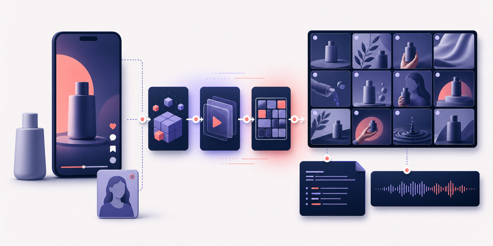

<p align="right">
  <a href="README.md">English</a> · <strong>简体中文</strong>
</p>

<p align="center">
  
</p>

# brand-ugc

把对标 UGC 视频和产品素材，转化为品牌专属的 12 宫格分镜和可直接用于
Seedance 的 15 秒视频提示词。

`brand-ugc` 是面向品牌营销人员和 UGC 创作者的 Codex Skill。它会解析对标视频，
根据新产品和可选人物素材改编创意，生成并检查最终分镜，然后输出视频总提示词和
12 条逐镜头运动指令。

> [!IMPORTANT]
> 当前版本**不直接生成最终 MP4**，而是交付可用于 Seedance 的分镜图和提示词。

## 快速开始

### 1. 确认运行条件

- [Codex](https://openai.com/codex/)
- Node.js 和 `npx`——只用于一键安装
- Python 3.10 或更高版本
- FFmpeg 和 FFprobe
- 一个 [EvoLink API Key](https://evolink.ai/dashboard/keys)

用户不需要手动配置模型。

macOS/Linux 可以先确认本机命令可用：

```bash
python3 --version
ffmpeg -version
ffprobe -version
```

### 2. 一条命令全局安装两个 Skill

只需运行一次：

```bash
npx -y skills@latest add haonan-c/brand-ugc --skill brand-ugc imagegen-api --agent codex --global --yes
```

该命令会同时安装两个必需的 Skill：

- `brand-ugc`——七阶段品牌 UGC 工作流
- `imagegen-api`——工作流使用的 EvoLink 生图适配器

当前 `skills` 安装器会把全局 Skill 放在用户目录的 `.agents/skills/` 下。
安装完成后请完全退出并重启 Codex，或新建一个任务，让 Codex 重新加载 Skill。

可以用以下命令确认两个 Skill 都已安装：

```bash
npx -y skills@latest list --global --agent codex
```

### 3. 配置 EvoLink API Key

推荐使用 `EVOLINK_API_KEY` 环境变量。

macOS/Linux 当前终端（只对从该终端启动的进程生效）：

```bash
export EVOLINK_API_KEY="<YOUR_EVOLINK_KEY>"
```

如需长期生效，请把同一条 `export` 写入启动 Codex 所使用的 Shell 配置文件，
然后完全退出并重启 Codex。Codex 桌面版用户也可以直接使用下面的本地文件方式。

Windows PowerShell 当前用户：

```powershell
[Environment]::SetEnvironmentVariable("EVOLINK_API_KEY", "<YOUR_EVOLINK_KEY>", "User")
```

设置持久环境变量后请重启 Codex。

使用上面的一键命令安装时，也可以只把密钥写入以下本地文件：

```text
Windows:      %USERPROFILE%\.agents\skills\imagegen-api\secrets\api_key.txt
macOS/Linux:  ~/.agents/skills/imagegen-api/secrets/api_key.txt
```

手动安装到 `.codex/skills/` 时，则使用对应的
`.codex/skills/imagegen-api/secrets/api_key.txt`。

不要把真实 Key 发到聊天、截图、日志或 Git 中。

### 4. 让 Codex 生成分镜

上传对标视频和产品图后发送：

```text
请使用 $brand-ugc 生成一个 15 秒品牌 UGC 分镜。

我已上传：
1. 对标视频
2. 产品图
3. 人物参考图（可选）
4. 文案或文案文件（可选）

产品名称：
<名称>

已核实的产品信息：
- <我提供的事实或产品图中直接可见的信息>

默认生成 2K 图片。不要添加未经证实的卖点、字幕、水印或平台 UI。
最后返回最终十二宫格分镜图和完整 Seedance 总提示词。
```

## 输入与输出

| 类型 | 内容 | 是否必需 |
| --- | --- | --- |
| 输入 | 对标 UGC 视频，通常约 15 秒 | 是 |
| 输入 | 产品图或产品多宫格图 | 是 |
| 输入 | 人物参考图 | 否 |
| 输入 | 文案、产品事实和限制 | 否，但建议提供 |
| 输出 | 最终 2K 十二宫格分镜图 | 是 |
| 输出 | 15 秒 Seedance 总提示词 | 是 |
| 输出 | 12 条逐镜头运动指令 | 是 |
| 输出 | 结构化 JSON、进度状态和 QA 报告 | 是 |

任务的全部数据保存在本地 `.brand_ugc/<任务名>/`，包括输入副本、中间产物、
生成结果、QA、进度和断点状态。面向用户的最终文件汇总在
`.brand_ugc/<任务名>/deliverables/`。整个 `.brand_ugc/` 已加入 Git 忽略规则；
只有明确需要其他位置时才传入 `--output-root`。

## 工作流程

工作流包含七个受控阶段：

1. **解析对标视频**——在本地生成最高 720p 的无声代理；有音频时另外生成单声道
   音轨，用于多模态分析。
2. **生成参考分镜**——从原视频本地抽取 12 帧。
3. **改写分镜脚本**——根据产品、可选人物、文案和已核实事实改编创意。
4. **编写 12 条生图提示词**——锁定构图、产品外观、人物和镜头连续性。
5. **生成模板分镜图**——生成一张 2K 十二宫格并执行视觉 QA。
6. **生成最终分镜图**——融合产品和可选人物，再次执行视觉 QA。
7. **编写视频提示词**——输出一个 Seedance 总提示词和 12 条详细运动指令。

所有结构化阶段都会通过 JSON Schema 校验。Schema 修复和图片纠错各最多重试一次。

## 隐私、费用和质量保护

- 原始对标视频只保存在本地。分析时仅发送派生的无声代理和可选单声道音轨。
- 只有工作流需要时，产品图和可选人物图才会发送到 EvoLink。
- 日志不得包含 API Key、Authorization、Base64 或临时资源 URL。
- 付费生成前会先检查 EvoLink 余额。
- 单次运行最多使用 14 次模型业务请求。
- 默认生成 `2K`，不会静默降级到 `1K`。
- 缺失的产品信息保持“未核实”，工作流不得虚构卖点。
- 图片连续两次未通过 QA 时会停止并保留报告，不把失败素材传给下游。

## 手动安装

没有 Node.js 时可以使用以下备用方式：

1. 从 [GitHub](https://github.com/haonan-c/brand-ugc/archive/refs/heads/main.zip)
   下载仓库。
2. 解压下载文件。
3. 把 `brand-ugc` 和 `imagegen-api` 两个目录都复制到 Codex Skills 目录。

```text
Windows:      %USERPROFILE%\.codex\skills\
macOS/Linux:  ~/.codex/skills/
```

复制完成后重启 Codex。

## 高级 CLI 用法

推荐使用 Codex 对话工作流。如需直接控制流水线：

```bash
python3 ~/.agents/skills/brand-ugc/scripts/run_public_pipeline.py \
  --run-name "my-product-ugc" \
  --video "/absolute/path/reference.mp4" \
  --product-image "/absolute/path/product.png" \
  --person-image "/absolute/path/person.jpg" \
  --copy-file "/absolute/path/copy.txt" \
  --product-info "已核实的产品事实和限制" \
  --resolution "2K"
```

如果采用手动安装，请把路径中的 `.agents/skills` 替换为 `.codex/skills`。
没有对应素材时可以省略选填参数。任务中断后，使用相同命令并添加 `--resume`。
已有任务 ID 时只查询状态，不会重复提交。

## 开发测试

在仓库根目录运行：

```bash
PYTHONPATH=. uv run --with pytest pytest -q
```

仓库结构：

```text
brand-ugc/       主工作流 Skill
imagegen-api/    EvoLink 生图适配器
tests/           合同、状态、媒体和离线端到端测试
test-assets/     已授权或已记录来源的测试输入
docs/            API 兼容性说明
```

## 许可证

项目原创代码采用 [MIT License](LICENSE)。

改编的工作流思路和受控词汇继续遵循上游许可证。详情见
[`brand-ugc/THIRD_PARTY_NOTICES.md`](brand-ugc/THIRD_PARTY_NOTICES.md) 和
[`brand-ugc/licenses/`](brand-ugc/licenses/)。
