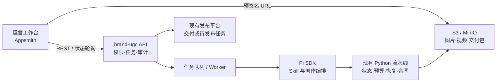

# brand-ugc 运营工作台 UI 选型

核查日期：2026-07-27

## 结论

社区已有成熟 UI，可以显著减少运营工作台的前端开发，但目前没有一个 Pi 专用 UI
能够直接覆盖“选题 → 生成图文/视频 → 人工审核 → 交付发布”的完整业务流程。

推荐方案是：

> **Appsmith 作为第一版运营工作台 + 一个很薄的 brand-ugc 业务 API + Pi/Python
> 继续作为后端执行层。**

其中：

- Appsmith 负责登录、选题列表、任务表单、状态、审核、素材预览和交付按钮；
- brand-ugc API 负责权限、任务状态、审计、对象存储和调用执行器；
- Pi 负责理解用户意图、加载 Skill 和创作编排；
- 现有 Python 流水线继续负责确定性状态、预算、防重复提交、恢复和产物合同；
- 图片和视频放 S3/MinIO，UI 通过预签名 URL 直传和预览，不把大文件经过低代码平台。

不建议让运营人员直接使用
[`agegr/pi-web`](https://github.com/agegr/pi-web)。它很适合内部开发者调试 Pi 会话，
但 README 明确说明没有应用级认证，而且能够调用高权限 Agent，不应暴露到公网。

## 候选方案

| 方案 | 最适合的角色 | 优点 | 主要缺口 | 判断 |
| --- | --- | --- | --- | --- |
| [Appsmith](https://docs.appsmith.com/) | REST-first 内部运营台 | 表格、表单、API、文件选择、JS 逻辑、自托管；Apache-2.0 | 精细查询权限属于商业能力，复杂产品体验仍需定制 | **MVP 首选** |
| [ToolJet](https://docs.tooljet.ai/docs/getting-started/platform-overview/) | 需要更多可视化工作流和 RBAC 的团队 | 组件丰富，REST、工作流、RBAC、multipart 上传、自托管 | 不应把已有 Python 状态机重复搭进 ToolJet Workflow；需确认版本/套餐边界 | 强备选 |
| [Budibase](https://docs.budibase.com/docs/what-is-budibase) | 快速做审批型原型 | 有现成双层审批模板、角色、自动化、附件和自托管 | 附件单文件上限 20 MB；部分团队权限为付费能力 | 审批原型优先 |
| [Refine](https://refine.dev/docs/) | 长期产品化、自研 React 团队 | MIT、代码完全可控，适合数据密集型后台、认证和访问控制 | 不是低代码，需要正常前端开发 | 第二阶段产品化 |
| [Pi Web UI 组件](https://www.npmjs.com/package/@earendil-works/pi-web-ui) | 自研页面中的 Agent 助手面板 | 有流式消息、工具调用、附件和 artifact 组件 | 只是 React 组件库，不是业务工作台 | 可选嵌入 |
| [Pi Web](https://github.com/agegr/pi-web) | 开发者调试台 | Pi 会话、模型、Skill、文件和工作区管理较完整 | 无应用级认证，高权限，界面以 coding agent 为中心 | 只限内网管理员 |
| [Dify](https://github.com/langgenius/dify) | 准备迁移到 Dify 工作流的团队 | Agent/Workflow 生态成熟，已有 Human Input | 接现有 Pi/Skill 仍要包 API，并会重复当前编排和状态机 | 当前不推荐 |
| [Open WebUI](https://docs.openwebui.com/features/) | 多用户聊天入口 | AI Chat、模型和 RBAC 能力成熟 | 核心信息架构是聊天，不是生产任务和审批看板 | 不作主工作台 |

## 为什么首选 Appsmith

当前 brand-ugc 已有 Python 流水线作为事实上的业务状态机，因此 UI 的主要任务是把
确定的操作变简单，而不是再创造一套编排引擎。Appsmith 的官方能力覆盖：

- [REST API 数据源](https://docs.appsmith.com/connect-data/reference/rest-api)；
- [文件选择器](https://docs.appsmith.com/reference/widgets/filepicker)和
  [API 上传](https://docs.appsmith.com/build-apps/how-to-guides/Send-Filepicker-Data-with-API-Requests)；
- [S3 上传](https://docs.appsmith.com/connect-data/how-to-guides/how-to-upload-to-s3)；
- 表格、表单、图片/视频 URL 预览、轮询任务状态以及自托管。

这意味着第一版只需要配置页面和少量 JS，不必从头开发后台框架、表格、表单和基本
登录。它的 Apache-2.0 许可证也比 AGPL/open-core 方案更容易纳入现有技术栈。

需要提前确认的一点是：Appsmith 官方把更细的
[查询级访问控制](https://docs.appsmith.com/advanced-concepts/granular-access-control/how-to-guides/restrict-query-access)
放在 Business Edition。第一版可把真正的授权全部放在 brand-ugc API，UI 角色只控制
页面和按钮可见性；这样不依赖低代码平台作为安全边界。

## ToolJet 与 Budibase 何时更合适

如果团队更看重可视化工作流、内置 RBAC 和 multipart 文件操作，ToolJet 是最强备选。
官方提供
[Workflow](https://docs.tooljet.ai/docs/workflows/overview/)、
[访问控制](https://docs.tooljet.ai/docs/user-management/role-based-access/access-control/)和
[multipart REST](https://docs.tooljet.ai/docs/data-sources/restapi/multipart-form-data-rest-api/)。
但 Workflow 只用于触发任务、通知和简单审批，不能复制 `run_state.json` 等已有状态逻辑。

如果目标是用最短时间验证“运营发起—主管审核—交付”流程，Budibase 很有吸引力：
官方直接提供
[双层审批 Change Requests 模板](https://docs.budibase.com/docs/change-requests)、
[自定义角色](https://docs.budibase.com/docs/user-roles)和
[附件组件](https://docs.budibase.com/docs/attachments)。不过附件文档给出的单文件上限是
20 MB，所以视频仍应直接上传对象存储；另外
[User Groups](https://docs.budibase.com/docs/user-groups)等能力存在套餐边界。

## 不可省略的薄后端

无论采用哪种社区 UI，都不能让浏览器直接启动 Pi、执行 Shell 或读取工作目录。至少需要
一个业务 API，建议沿用 Python 技术栈实现 FastAPI：

```text
POST /uploads/presign
GET  /topics
POST /jobs
GET  /jobs/{job_id}
POST /jobs/{job_id}/approve-plan
POST /jobs/{job_id}/visual-qa
POST /jobs/{job_id}/handoff
```

后端职责：

1. 校验用户、品牌、角色和状态迁移；
2. 把人工审批记录成 `谁、何时、从什么状态到什么状态`；
3. 投递后台任务并返回 `job_id`，UI 轮询状态；
4. 调用受控的 Pi SDK/RPC 适配层和现有 Python 脚本；
5. 用 PostgreSQL 保存任务索引和审计，用现有 `.brand_ugc` 状态作为生成流水线依据；
6. 用 S3/MinIO 保存图片、视频和交付包；
7. 生成交付信息，调用现有发布平台 API 或创建“待人工发布”任务。

浏览器、业务 API 和执行器的边界应是：



## 第一版页面范围

第一版只做五个页面即可：

1. **今日选题**：候选选题、品牌、平台、内容类型，选择后创建任务；
2. **内容配置**：补充素材、受众、卖点和参考内容；
3. **生成进度**：显示当前阶段、耗时、失败原因和“安全重试”；
4. **审核台**：左侧文案/分镜，右侧图片或视频，提供通过、修改意见、重新生成；
5. **交付中心**：下载交付包、复制发布文案、发送到现有发布平台、记录领取人。

聊天框可以作为“高级修改”入口，但不应作为主导航。运营人员的主路径应是状态明确的
按钮、表单和审核卡片。

## 实施建议

先做一个短周期可丢弃的 Appsmith Spike，只接一个图文 Skill，验收：

- 从选题创建任务；
- 上传参考素材；
- 能看到阶段进度；
- 在人工审批点停住；
- 审核后继续生成；
- 预览成品并生成交付任务。

Spike 成功后再接视频流水线和发布平台。若运营人员长期高频使用、需要更强品牌化和复杂
交互，再把验证过的页面迁移到 Refine/自研 React；后端 API 与 Pi/Python 执行层无需
重做。
