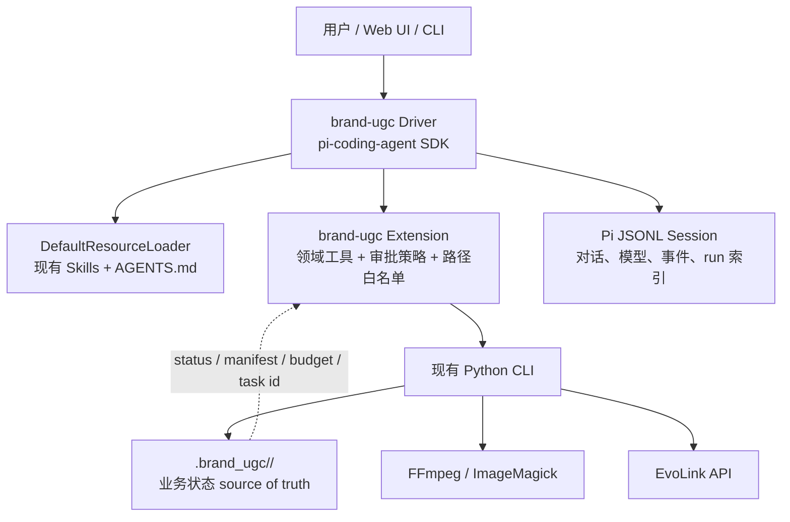

# Pi Agent 作为 brand-ugc 底层 Agent Driver 的评估

核查日期：2026-07-27  
Pi 源码快照：[`2efa728d`](https://github.com/earendil-works/pi/commit/2efa728d2ee90ef597626e96b1e28ef2b279f07c)  
brand-ugc 源码快照：[`a577c3de`](https://github.com/haonan-c/brand-ugc/commit/a577c3de43bff61209a1688c9efefc98a1abcd32)

## 结论

**可以，而且值得做，但应把 Pi 放在“Agent 编排层”，不能让它替代现有 Python
流水线的确定性状态机。**

推荐的落点是：

> `@earendil-works/pi-coding-agent` SDK + 一个很薄的 brand-ugc Extension/工具适配层
> + 原样保留五个 Skill、Python 脚本、`.brand_ugc/` 状态和 EvoLink 适配器。

不建议直接把 `pi-agent-core` 当成当前生产入口。`pi-agent-core` 适合需要自己搭建
完整宿主、会话、工具、安全策略和资源加载器的场景；而
`pi-coding-agent` 已经在 core 之上提供 Skill 发现、`AgentSession`、扩展、默认工具、
会话压缩、CLI、RPC 和可嵌入 SDK。当前 Coding Agent SDK 实际仍用
`AgentSession + Agent`，不是正在演进的 `AgentHarness`
（[`sdk.ts`](https://github.com/earendil-works/pi/blob/2efa728d2ee90ef597626e96b1e28ef2b279f07c/packages/coding-agent/src/core/sdk.ts#L1-L16),
[`createAgentSession`](https://github.com/earendil-works/pi/blob/2efa728d2ee90ef597626e96b1e28ef2b279f07c/packages/coding-agent/src/core/sdk.ts#L169-L185),
[`Agent` 构造`](https://github.com/earendil-works/pi/blob/2efa728d2ee90ef597626e96b1e28ef2b279f07c/packages/coding-agent/src/core/sdk.ts#L292-L360)）。

如果只是把 Codex CLI 换成 Pi CLI，不增加受控工具和审批策略，主要收益是模型与宿主
可移植性，不会自动提高内容质量或流程可靠性。真正的增益来自：

1. Pi 原生读取现有 Agent Skills；
2. Extension 把“模型可以执行任意 Bash”收窄成少量领域工具；
3. SDK/RPC 让产品 UI、审批、进度和恢复可以由应用显式控制；
4. 现有 Python 状态继续负责防重复计费、断点恢复和合同校验。

## 快速决策表

| 评估项 | 结论 | 对 brand-ugc 的含义 |
| --- | --- | --- |
| Skill 兼容性 | 高 | 现有 `SKILL.md + scripts + references + assets` 结构可以直接复用 |
| Agent loop / 工具 | 高 | 可用类型化工具、流式事件、工具前后钩子承接领域编排 |
| 可嵌入性 | 高 | Node/TypeScript 用 SDK；非 Node 宿主可用 JSONL RPC |
| 模型提供商 | 高 | 可在不改 Skill 的情况下切换多个工具调用模型 |
| 会话与上下文 | 中高 | 适合保存对话和编排痕迹，但不应成为付费流水线的唯一状态源 |
| MCP | 低 | 无内置 MCP；本项目当前也不需要为了 Pi 引入 MCP |
| 权限与沙箱 | 默认低、可加固 | Project Trust 不是运行时沙箱；生产必须做工具白名单和进程隔离 |
| 生产耐久性 | 中 | Coding Agent 会话成熟；新 `AgentHarness` 的完整耐久恢复仍在设计中 |
| 许可 | 高 | MIT，可商用、修改和分发，但需保留许可文本 |
| API 稳定性 | 中 | 项目活跃但仍为 `0.x`，近期变更快，必须锁定版本并做升级测试 |

## 1. 先澄清当前项目名称与版本

用户常说的 `badlogic/pi-mono` 目前会指向官方
[`earendil-works/pi`](https://github.com/earendil-works/pi)。截至本次核查，正式 npm
包已经是
[`@earendil-works/pi-agent-core`](https://www.npmjs.com/package/@earendil-works/pi-agent-core)
和
[`@earendil-works/pi-coding-agent`](https://www.npmjs.com/package/@earendil-works/pi-coding-agent)；
源码中的两个包均为 `0.82.1`，要求 Node.js `>=22.19.0`
（[`agent-core package.json`](https://github.com/earendil-works/pi/blob/2efa728d2ee90ef597626e96b1e28ef2b279f07c/packages/agent/package.json#L1-L17),
[`coding-agent package.json`](https://github.com/earendil-works/pi/blob/2efa728d2ee90ef597626e96b1e28ef2b279f07c/packages/coding-agent/package.json#L1-L21),
[`Node engines`](https://github.com/earendil-works/pi/blob/2efa728d2ee90ef597626e96b1e28ef2b279f07c/packages/coding-agent/package.json#L91-L100)）。
旧的 `@mariozechner/*` npm 包停在 `0.73.1` 并已标记迁移到新 scope，因此新集成
不应继续引用旧包。

两个包和仓库根许可证都是 MIT
（[`agent-core license 字段`](https://github.com/earendil-works/pi/blob/2efa728d2ee90ef597626e96b1e28ef2b279f07c/packages/agent/package.json#L45-L53),
[`coding-agent license 字段`](https://github.com/earendil-works/pi/blob/2efa728d2ee90ef597626e96b1e28ef2b279f07c/packages/coding-agent/package.json#L91-L99),
[`LICENSE`](https://github.com/earendil-works/pi/blob/2efa728d2ee90ef597626e96b1e28ef2b279f07c/LICENSE#L1-L20)）。

## 2. `pi-agent-core` 与 `pi-coding-agent` 的职责

### 2.1 `pi-agent-core`：通用 Agent 运行内核

`pi-agent-core` 的稳定主干是一个状态化 `Agent` 和底层 agent loop。它负责：

- 消息到模型的流式请求；
- 模型返回工具调用后的参数校验与执行；
- 工具结果回填后继续下一轮模型调用；
- steering/follow-up 消息队列；
- `agent_start`、`turn_start`、`message_update`、`tool_execution_*` 等事件；
- 上下文转换、模型切换、思考等级和中止。

这些职责在官方
[`Agent README`](https://github.com/earendil-works/pi/blob/2efa728d2ee90ef597626e96b1e28ef2b279f07c/packages/agent/README.md#L41-L122)
和
[`runLoop()` 源码](https://github.com/earendil-works/pi/blob/2efa728d2ee90ef597626e96b1e28ef2b279f07c/packages/agent/src/agent-loop.ts#L155-L260)
中可以直接核对。

同一条 assistant 消息里的多个工具调用默认并行执行，也可以全局或逐工具强制串行；
工具在执行前经过参数校验，`beforeToolCall` 可以阻断，`afterToolCall` 可以改写结果或
提示 agent 停止
（[`工具执行模式`](https://github.com/earendil-works/pi/blob/2efa728d2ee90ef597626e96b1e28ef2b279f07c/packages/agent/README.md#L113-L144),
[`并行/串行分支源码`](https://github.com/earendil-works/pi/blob/2efa728d2ee90ef597626e96b1e28ef2b279f07c/packages/agent/src/agent-loop.ts#L409-L425),
[`工具钩子类型`](https://github.com/earendil-works/pi/blob/2efa728d2ee90ef597626e96b1e28ef2b279f07c/packages/agent/src/types.ts#L52-L117)）。
brand-ugc 的付费阶段有严格顺序，因此领域工具应声明 `executionMode: "sequential"`，
不能依赖默认并行行为。

`pi-agent-core` 现在还导出了 `AgentHarness`、内存/JSONL Session、Skill 与内置工具等
更高层能力
（[`index.ts` exports](https://github.com/earendil-works/pi/blob/2efa728d2ee90ef597626e96b1e28ef2b279f07c/packages/agent/src/index.ts#L1-L50)）。
但官方自己的迁移文档明确写着：

- `AgentHarness` 的自动压缩和重试决策点尚未完成；
- 完整 hook/event 机制仍未实现；
- 半耐久恢复仍是 planned；
- 未完成工具调用默认不能安全重试；
- provider stream 无法从中途恢复。

证据见
[`AgentHarness 当前限制`](https://github.com/earendil-works/pi/blob/2efa728d2ee90ef597626e96b1e28ef2b279f07c/packages/agent/docs/agent-harness.md#L228-L237)、
[`迁移 TODO`](https://github.com/earendil-works/pi/blob/2efa728d2ee90ef597626e96b1e28ef2b279f07c/packages/agent/docs/agent-harness.md#L264-L390)
和
[`durable harness 设计`](https://github.com/earendil-works/pi/blob/2efa728d2ee90ef597626e96b1e28ef2b279f07c/packages/agent/docs/durable-harness.md#L7-L24)。
因此当前不应把新 `AgentHarness` 当成 brand-ugc 付费任务的唯一事务引擎。

### 2.2 `pi-coding-agent`：可直接使用和嵌入的 Agent 宿主

`pi-coding-agent` 在 core 之上增加了默认 `read/write/edit/bash` 工具、Skill 和上下文
发现、Extension、认证和模型目录、会话树、压缩、TUI、JSON、RPC 与 SDK。官方将其
定义为可通过 TypeScript Extensions、Skills、Prompt Templates 和 Pi Packages 定制的
最小 coding harness，并提供 interactive、print/JSON、RPC、SDK 四种使用方式
（[`README`](https://github.com/earendil-works/pi/blob/2efa728d2ee90ef597626e96b1e28ef2b279f07c/packages/coding-agent/README.md#L15-L19)）。

SDK 的 `createAgentSession()` 会使用 `ResourceLoader` 加载 extensions、skills、prompt
templates、themes 和 context files；不传自定义 loader 时使用
`DefaultResourceLoader`
（[`SDK 核心概念`](https://github.com/earendil-works/pi/blob/2efa728d2ee90ef597626e96b1e28ef2b279f07c/packages/coding-agent/docs/sdk.md#L44-L64)）。
`AgentSession` 再负责 agent 生命周期、消息历史、模型状态、压缩和事件流
（[`AgentSession API`](https://github.com/earendil-works/pi/blob/2efa728d2ee90ef597626e96b1e28ef2b279f07c/packages/coding-agent/docs/sdk.md#L66-L114)）。

这正是本项目需要的层级：我们要补的是“如何选择并安全运行 brand-ugc 工作流”，
不是重新实现一个通用 Agent 宿主。

## 3. 能力逐项核对

### 3.1 Skills：现有五个 Skill 基本可以原样复用

Pi 实现 Agent Skills 标准。启动时只扫描名称与描述，匹配任务后由模型读取完整
`SKILL.md`，脚本、references、assets 继续通过相对路径使用
（[`Skills 工作方式`](https://github.com/earendil-works/pi/blob/2efa728d2ee90ef597626e96b1e28ef2b279f07c/packages/coding-agent/docs/skills.md#L64-L71),
[`Skill 目录结构`](https://github.com/earendil-works/pi/blob/2efa728d2ee90ef597626e96b1e28ef2b279f07c/packages/coding-agent/docs/skills.md#L92-L105)）。

Pi 原生扫描 `~/.agents/skills/`，也会在可信项目中扫描 `.agents/skills/`，还支持
Pi Package 和重复 `--skill <path>` 显式加载
（[`Skill locations`](https://github.com/earendil-works/pi/blob/2efa728d2ee90ef597626e96b1e28ef2b279f07c/packages/coding-agent/docs/skills.md#L20-L41)）。
因此本仓库 README 当前通过 `skills` CLI 安装到 Agent Skills 公共目录的方式，与 Pi
兼容。PoC 阶段无需重写五份 `SKILL.md`。

一个现实限制是官方明确说明模型“不一定总会读取完整 Skill”；需要可靠触发时，应使用
`/skill:name` 或由宿主显式注入/选择 Skill
（[`按需加载说明`](https://github.com/earendil-works/pi/blob/2efa728d2ee90ef597626e96b1e28ef2b279f07c/packages/coding-agent/docs/skills.md#L64-L80)）。
对生产 UI 来说，用户已经选定“图文”或“视频”后应显式调用对应 Skill，不要再依赖
模型自主匹配。

### 3.2 工具与 Extension：最适合承接 brand-ugc 的控制面

SDK 默认提供 `read`、`bash`、`edit`、`write`，还可选 `grep`、`find`、`ls`；
`createAgentSession()` 支持 allowlist、denylist、禁用全部默认工具以及注入 custom tools
（[`SDK Tools`](https://github.com/earendil-works/pi/blob/2efa728d2ee90ef597626e96b1e28ef2b279f07c/packages/coding-agent/docs/sdk.md#L491-L520),
[`CreateAgentSessionOptions`](https://github.com/earendil-works/pi/blob/2efa728d2ee90ef597626e96b1e28ef2b279f07c/packages/coding-agent/src/core/sdk.ts#L38-L84)）。

Extension 可以注册类型化工具、拦截并阻断工具调用、修改结果、注入上下文、询问用户、
增加命令，以及通过 custom entries 持久化扩展状态
（[`Extension capabilities`](https://github.com/earendil-works/pi/blob/2efa728d2ee90ef597626e96b1e28ef2b279f07c/packages/coding-agent/docs/extensions.md#L3-L29),
[`事件顺序`](https://github.com/earendil-works/pi/blob/2efa728d2ee90ef597626e96b1e28ef2b279f07c/packages/coding-agent/docs/extensions.md#L273-L348)）。

因此生产模式不应给模型一个泛化 `bash`，而应注册少量高层工具，例如：

- `brand_ugc_diagnose`
- `brand_profile_resolve`
- `image_post_submit_plan`
- `image_post_prepare`
- `image_post_approve_and_resume`
- `image_post_submit_visual_qa`
- `storyboard_run_or_resume`
- `brand_ugc_get_status`

这些工具只把经过 Schema 校验的参数转成现有 Python CLI 调用，并解析 JSON 结果。
这样模型负责理解与创作，Python 负责合同、状态与副作用。

### 3.3 MCP：没有内置能力，本项目也不需要把它作为前置条件

Pi 官方明确没有内置 MCP、sub-agent、permission popup、plan mode 或 background bash；
这些能力需要 Extension、第三方 Package 或外部容器/tmux
（[`设计原则`](https://github.com/earendil-works/pi/blob/2efa728d2ee90ef597626e96b1e28ef2b279f07c/packages/coding-agent/docs/usage.md#L292-L298),
[`README philosophy`](https://github.com/earendil-works/pi/blob/2efa728d2ee90ef597626e96b1e28ef2b279f07c/packages/coding-agent/README.md#L491-L505)）。

对 brand-ugc 而言，这不是阻塞项：现有能力全部是本地 Skill 和 Python CLI，直接工具
适配比“先包成 MCP Server，再为 Pi 安装 MCP Adapter”更短、更容易审计。只有未来需要
把同一 UGC 控制面同时提供给多个远程 Agent 平台时，才值得把领域工具单独封装为 MCP。

### 3.4 上下文与压缩：适合对话，不适合代替业务状态

Pi 会加载全局、父目录和当前目录的 `AGENTS.md`/`CLAUDE.md`
（[`Context Files`](https://github.com/earendil-works/pi/blob/2efa728d2ee90ef597626e96b1e28ef2b279f07c/packages/coding-agent/docs/usage.md#L98-L106)），
因此本项目现有 Agent 行为约束可以继续作为宿主级指令。

当上下文超过 `contextWindow - reserveTokens` 时，Coding Agent 自动把旧消息总结为
compaction entry，并保留最近消息；默认 reserve 为 16,384 tokens、keep recent 为
20k
（[`Compaction 触发和过程`](https://github.com/earendil-works/pi/blob/2efa728d2ee90ef597626e96b1e28ef2b279f07c/packages/coding-agent/docs/compaction.md#L25-L45)）。
这能维持长对话，但总结必然是有损的。因此审批状态、EvoLink task ID、请求预算和输入
哈希绝不能只存在于 prompt 或 Pi session summary 中。

### 3.5 会话：适合审计和恢复“对话”，业务恢复仍以 `.brand_ugc` 为准

Coding Agent 会话自动保存为按 cwd 组织的 JSONL，并通过 `id/parentId` 形成树；
支持继续、fork、tree navigation 和 compaction
（[`Sessions`](https://github.com/earendil-works/pi/blob/2efa728d2ee90ef597626e96b1e28ef2b279f07c/packages/coding-agent/docs/sessions.md#L1-L20),
[`Session format`](https://github.com/earendil-works/pi/blob/2efa728d2ee90ef597626e96b1e28ef2b279f07c/packages/coding-agent/docs/session-format.md#L1-L27)）。
Extension custom entry 不进入模型上下文，custom message 则会进入上下文
（[`CustomEntry / CustomMessageEntry`](https://github.com/earendil-works/pi/blob/2efa728d2ee90ef597626e96b1e28ef2b279f07c/packages/coding-agent/docs/session-format.md#L263-L284)）。

建议每个 UGC `run-name` 绑定一个 Pi session，并在 custom entry 中镜像：
`run_name`、`workflow`、`run_dir`、`last_observed_status`、manifest digest。它们用于 UI
导航和审计，不用于判断能否重复提交付费请求。真正判断仍由 Python 的
`run_state.json`、`stage_state.json`、`request_budget.json` 和 `task.json` 完成。

### 3.6 模型提供商：选择面广，但要对具体模型做工作流验收

Pi 的 `pi-ai` 只收录支持 tool calling 的模型，并内置 OpenAI、Anthropic、Google、
DeepSeek、Mistral、Groq、Cerebras、OpenRouter、Bedrock、Cloudflare、Vercel、多个
中国模型服务以及任意 OpenAI-compatible API
（[`pi-ai provider list`](https://github.com/earendil-works/pi/blob/2efa728d2ee90ef597626e96b1e28ef2b279f07c/packages/ai/README.md#L57-L89)）。
Coding Agent 还支持 OAuth 订阅登录、API key、auth file、cloud provider 和自定义
provider
（[`Providers`](https://github.com/earendil-works/pi/blob/2efa728d2ee90ef597626e96b1e28ef2b279f07c/packages/coding-agent/docs/providers.md#L1-L26),
[`API-key providers`](https://github.com/earendil-works/pi/blob/2efa728d2ee90ef597626e96b1e28ef2b279f07c/packages/coding-agent/docs/providers.md#L58-L105)）。

这能降低外层 Agent 对单一模型的绑定，但不意味着不同模型会稳定地产出同样的内容
方案或视觉 QA。需要把“路由正确率、Schema 首次通过率、审批遵守率、视觉 QA 召回”
作为具体模型的验收指标，而不是只看 Pi 是否支持该 provider。

### 3.7 可嵌入 API：优先 SDK，跨语言再用 RPC

Node/TypeScript 应直接使用 `createAgentSession()`；它支持自定义 ResourceLoader、
模型、工具和内存或持久 Session
（[`SDK Quick Start`](https://github.com/earendil-works/pi/blob/2efa728d2ee90ef597626e96b1e28ef2b279f07c/packages/coding-agent/docs/sdk.md#L16-L42)）。
需要创建、切换、fork 或导入多会话时，用 `AgentSessionRuntime`
（[`runtime API`](https://github.com/earendil-works/pi/blob/2efa728d2ee90ef597626e96b1e28ef2b279f07c/packages/coding-agent/docs/sdk.md#L114-L178)）。

非 Node 应用可以把 Pi 作为子进程运行 `pi --mode rpc`，用 LF 分隔 JSONL 命令、响应和
事件
（[`RPC overview`](https://github.com/earendil-works/pi/blob/2efa728d2ee90ef597626e96b1e28ef2b279f07c/packages/coding-agent/docs/rpc.md#L1-L37)）。
本项目虽然以 Python 为主，仍建议新增一个很薄的 TypeScript driver 使用 SDK，再由它
调用 Python；只有宿主产品已经是 Python 且不希望引入 Node 内嵌层时，才选 RPC。

### 3.8 权限与安全：必须由我们补齐

Project Trust 只控制是否加载项目本地设置、资源、包和 Extension；它不是沙箱，也不
限制模型在会话开始后让工具做什么
（[`Project Trust boundary`](https://github.com/earendil-works/pi/blob/2efa728d2ee90ef597626e96b1e28ef2b279f07c/packages/coding-agent/docs/security.md#L3-L29)）。
Pi 内置工具和 Extension 都以启动 Pi 的用户权限运行；官方明确建议无人值守或不可信
任务使用容器、VM、micro-VM 或 policy-controlled sandbox
（[`No Built-in Sandbox`](https://github.com/earendil-works/pi/blob/2efa728d2ee90ef597626e96b1e28ef2b279f07c/packages/coding-agent/docs/security.md#L31-L53)）。

Extension 确实可以实现 permission gate 和路径保护，但它们是应用策略，不是 Pi 的安全
边界。官方示例在无 UI 模式下默认拒绝危险命令
（[`permission-gate.ts`](https://github.com/earendil-works/pi/blob/2efa728d2ee90ef597626e96b1e28ef2b279f07c/packages/coding-agent/examples/extensions/permission-gate.ts#L10-L33)）
并阻止写入 `.env`、`.git/`、`node_modules/`
（[`protected-paths.ts`](https://github.com/earendil-works/pi/blob/2efa728d2ee90ef597626e96b1e28ef2b279f07c/packages/coding-agent/examples/extensions/protected-paths.ts#L10-L29)）。

## 4. 与本仓库现状的适配

### 4.1 这套 Skill 已经把正确的职责留给了确定性代码

本仓库有五个标准 Agent Skill：统一入口 `ask-brand`、档案 `brand-profile`、两个生产
入口 `ugc-image-post` / `ugc-storyboard`，以及共享 `image-generator`
（[`README 架构`](https://github.com/haonan-c/brand-ugc/blob/a577c3de43bff61209a1688c9efefc98a1abcd32/README.zh-CN.md#L12-L49)）。

它们不是纯 prompt：

- `ask-brand` 用确定性路由脚本返回 `ready / needs_input / needs_confirmation`，且一次
  只选择一条生产路径
  （[`route_request.py`](https://github.com/haonan-c/brand-ugc/blob/a577c3de43bff61209a1688c9efefc98a1abcd32/ask-brand/scripts/route_request.py#L83-L163)）。
- `brand-profile` 校验 brand/product ID 和有证据的 `verified_claims`，已有档案必须显式
  `--replace`
  （[`manage_profile.py`](https://github.com/haonan-c/brand-ugc/blob/a577c3de43bff61209a1688c9efefc98a1abcd32/brand-profile/scripts/manage_profile.py#L31-L97)）。
- 图文流程验证 4–9 页、恰好三个标题、受控 layout、事实证据和品牌禁用表达
  （[`validate_plan()`](https://github.com/haonan-c/brand-ugc/blob/a577c3de43bff61209a1688c9efefc98a1abcd32/ugc-image-post/scripts/run_pipeline.py#L83-L188)）。
- 图文流程先写 `awaiting_approval`，只有显式 `--approve --resume` 才继续
  （[`审批状态`](https://github.com/haonan-c/brand-ugc/blob/a577c3de43bff61209a1688c9efefc98a1abcd32/ugc-image-post/scripts/run_pipeline.py#L1018-L1047)）。
- 在线图文基础请求为页数，全组最多增加两次纠错；视觉 QA 未提交时停在
  `awaiting_visual_qa`
  （[`request budget`](https://github.com/haonan-c/brand-ugc/blob/a577c3de43bff61209a1688c9efefc98a1abcd32/ugc-image-post/scripts/run_pipeline.py#L495-L569),
  [`visual QA 状态机`](https://github.com/haonan-c/brand-ugc/blob/a577c3de43bff61209a1688c9efefc98a1abcd32/ugc-image-post/scripts/run_pipeline.py#L629-L716)）。
- 视频流程把 stage state、进度和最多 14 次模型业务请求保存到本地
  （[`StageState / RequestBudget`](https://github.com/haonan-c/brand-ugc/blob/a577c3de43bff61209a1688c9efefc98a1abcd32/ugc-storyboard/scripts/run_public_pipeline.py#L158-L233)）。
- 视频结构化阶段按 JSON Schema 生成并只自动修复一次
  （[`run_structured_stage()`](https://github.com/haonan-c/brand-ugc/blob/a577c3de43bff61209a1688c9efefc98a1abcd32/ugc-storyboard/scripts/run_public_stage.py#L78-L147)）。
- 生图 task ID 会先落盘；恢复时已有 ID 就只轮询，不重新创建任务
  （[`generate_image()`](https://github.com/haonan-c/brand-ugc/blob/a577c3de43bff61209a1688c9efefc98a1abcd32/ugc-storyboard/scripts/evolink_client.py#L376-L436)）。

这些能力比通用 Agent session 更接近业务事务语义，应继续作为 source of truth。

### 4.2 Pi 能真正改善的部分

| 现有环节 | 仅换 Pi CLI | 加 SDK + Extension 后 |
| --- | --- | --- |
| 需求理解与 Skill 选择 | 可用，仍依赖模型主动读 Skill | 宿主显式调用路由工具并选择 Skill，结果可测试 |
| 内容方案生成 | 可由任意 Pi 模型完成 | 用类型化 `submit_plan` 工具直接校验并落盘 |
| 用户确认 | 依赖对话纪律 | UI/RPC 宿主读取 `awaiting_approval` 后显式解锁 |
| Python CLI 调用 | 模型生成 Bash，参数容易漂移 | Extension 统一组装参数、工作目录和环境 |
| 长任务恢复 | Pi session + 脚本状态并存 | session 只定位 run；Python 状态决定恢复动作 |
| 费用保护 | 主要依赖脚本，正确 | 继续依赖脚本，Extension 再阻止越级 approve |
| 权限 | 默认 Bash 权限过大 | 生产会话禁用默认 bash/write，只开放领域工具 |
| 多模型切换 | 受原 Agent 宿主限制 | Pi provider/runtime 直接切换，Skill 不变 |
| 产品化 UI | CLI 绑定 | SDK 事件或 RPC JSONL 可接 Web/Desktop UI |

### 4.3 Pi 不会自动改善的部分

- 不会自动提高 UGC 文案、视觉审美或品牌一致性；这些主要由模型、Skill 指令、素材和
  QA 规则决定。
- 不会替代 EvoLink 图片任务、FFmpeg、ImageMagick 或现有 JSON Schema。
- 不会自动保证“先审批后付费”；必须通过领域工具边界和宿主 UI 强制执行。
- 不会提供生产级任务队列、跨进程锁、租约、定时任务或分布式去重。
- 不会因为 session 可恢复，就安全地自动重试一个可能已经产生外部副作用的工具调用；
  Pi 自己的耐久设计也明确把未完成非幂等工具调用列为风险
  （[`durable recovery policy`](https://github.com/earendil-works/pi/blob/2efa728d2ee90ef597626e96b1e28ef2b279f07c/packages/agent/docs/durable-harness.md#L118-L152)）。

## 5. 建议架构

### 职责边界

**Pi/模型负责：**

- 理解用户目标；
- 选择一个工作流；
- 读取 Skill 和 references；
- 在受控 Schema 内生成内容方案；
- 解释缺失输入和展示结果；
- 对生成图执行模型视觉 QA。

**Extension/宿主负责：**

- 把用户或模型意图转换成高层领域工具；
- 所有路径 canonicalize 后限制在允许目录；
- 根据 Python 返回状态开放下一步；
- 交互模式显示确认框，headless 模式要求外部 approval token；
- 禁止模型直接读取密钥和直接拼接任意 shell；
- 把 Pi session 与 `run-name` 关联。

**Python 负责：**

- 输入固化与哈希；
- Schema/事实/品牌合同；
- 审批状态；
- 阶段顺序与请求预算；
- EvoLink task ID 和幂等恢复；
- 媒体处理、排版、QA 文件和交付物。

### 两种运行配置

1. **开发者交互模式**：允许 `read/grep/find/ls`，`bash` 经过 permission gate；适合调试
   Skill 和脚本。
2. **生产执行模式**：`noTools: "all"`，只注册 brand-ugc 领域工具；工作进程放入容器，
   只挂载指定输入与 `.brand_ugc`，只注入 EvoLink 所需凭据和网络访问。

生产模式不要加载未知第三方 Pi Package。官方说明 Pi Package 的 Extension 可执行任意
代码、Skill 可指示模型执行任意动作
（[`Package security`](https://github.com/earendil-works/pi/blob/2efa728d2ee90ef597626e96b1e28ef2b279f07c/packages/coding-agent/docs/packages.md#L17-L43)）。

## 6. 主要风险与应对

| 风险 | 等级 | 应对 |
| --- | --- | --- |
| 默认无沙箱、工具继承用户权限 | 高 | 生产禁用默认 bash/write；容器隔离；目录与网络白名单 |
| 模型绕过 Skill 或漏读完整 Skill | 高 | 产品入口显式 `/skill:name` 或 ResourceLoader 注入；路由工具结果决定工作流 |
| 对话压缩丢失审批/预算细节 | 高 | `.brand_ugc` 是唯一业务状态；每步先读状态文件 |
| Agent crash 后重复付费调用 | 高 | 不自动重放未知状态的领域工具；复用 Python task ID/`--resume`；调用前后持久化 |
| `AgentHarness` 仍在快速演进 | 高 | 当前集成只用 Coding Agent `AgentSession` SDK；暂不依赖新 Harness 的耐久恢复 |
| Pi `0.x` API 变动 | 中高 | 精确锁定 `0.82.1` 和 lockfile；升级只走兼容测试，不自动浮动 |
| npm scope 已迁移 | 中 | 全部使用 `@earendil-works/*`；CI 禁止旧 `@mariozechner/*` |
| 多模型输出差异 | 中高 | 固定默认模型；按模型运行路由、Schema、事实、视觉 QA 基准 |
| Pi session 与业务 run 分叉 | 中 | session custom entry 只存 run 引用；业务状态始终由 `run_dir` 决定 |
| Extension 拥有完整系统权限 | 高 | Extension 代码纳入本仓库审查；禁止运行时拉取未锁定包 |
| MCP 生态不可直接用 | 低 | v1 不使用 MCP；未来若有跨平台需求再单独做受控 adapter |

## 7. 活跃度与稳定性判断

项目活跃度很高。仅 2026-07-16 至 2026-07-25，agent-core changelog 就连续出现
`0.80.9`、`0.80.10`、`0.81.0`、`0.81.1`、`0.82.0`、`0.82.1`
（[`agent-core CHANGELOG`](https://github.com/earendil-works/pi/blob/2efa728d2ee90ef597626e96b1e28ef2b279f07c/packages/agent/CHANGELOG.md#L3-L83)），
Coding Agent 同期也有大量 provider、RPC、compaction 和安全依赖更新
（[`coding-agent CHANGELOG`](https://github.com/earendil-works/pi/blob/2efa728d2ee90ef597626e96b1e28ef2b279f07c/packages/coding-agent/CHANGELOG.md#L3-L91)）。

这说明维护响应和功能演进强，但也说明集成面变化快。再结合版本仍为 `0.x`、包 scope
刚迁移、新 `AgentHarness` 尚未 migration-ready，合理判断是：

- CLI/`AgentSession`/Skill/Extension 的可用性：较成熟；
- 作为受控本地 Agent 宿主：适合；
- 不锁版本直接作为无人值守生产事务引擎：不适合；
- 精确锁版本、外置业务状态并经过回归测试后：可用于生产 PoC。

## 8. 三阶段实施路径与验收指标

### 阶段一：零重写兼容 PoC

目标：证明现有 Skill 在 Pi 上能被正确发现和执行，不改 Python。

工作：

1. 精确安装 `@earendil-works/pi-coding-agent@0.82.1`。
2. 用现有 Agent Skills 安装方式安装五个 Skill，或通过 `--skill` 显式加载。
3. 分别显式调用 `ask-brand`、`ugc-image-post` offline、`ugc-storyboard` 的只读/前置
   路径。
4. 记录 Pi 事件、模型、工具调用和最终产物。

验收：

- 五个 Skill 100% 被发现，无 frontmatter 阻断错误；
- 20 个固定路由用例与 `route_request.py` 结果 100% 一致；
- 图文 offline 示例完成并与现有合同一致；
- 所有现有 32 个单元/离线集成测试继续通过；
- 未配置 EvoLink key 时没有远程付费请求。

### 阶段二：薄 Extension + 强制审批

目标：把自然语言 Bash 编排收窄为领域工具，证明不会越过费用与状态边界。

工作：

1. 新增 TypeScript Extension 和精确类型的领域工具。
2. `submit_plan` / `submit_visual_qa` 参数直接使用现有 JSON Schema。
3. 生产会话禁用默认 bash/write/edit。
4. Extension 解析 Python JSON stdout，并把 run/status 镜像到 session custom entry。
5. UI 审批和 headless approval token 都在调用 `--approve` 前校验。

验收：

- 未审批的 20 次测试中，EvoLink create-image 请求数始终为 0；
- 相同 run 连续 resume 不重复创建已存在的图片任务；
- 修改已固化输入后 100% 被拒绝或要求新 run-name；
- 请求预算上限无法从模型工具参数覆盖；
- 路径逃逸、读取 secrets、任意 shell 命令测试 100% 被阻断；
- 图文状态按 `awaiting_approval → awaiting_visual_qa → completed` 演进；
- Extension crash 后以 Python 状态恢复，不自动重放未知付费工具。

### 阶段三：SDK 产品化与模型基准

目标：把 PoC 接入产品 UI/服务，并验证至少一个默认模型组合可稳定使用。

工作：

1. 用 `createAgentSession()` 建立长驻 driver；一项 UGC run 对应一个 session。
2. 容器化工具执行，只挂载任务输入、品牌档案和 `.brand_ugc/<run-name>`。
3. 对 2–3 个候选模型跑固定素材集，比较成本、路由、Schema、事实和视觉 QA。
4. 增加进程中止、网络超时、EvoLink pending task、上下文压缩后的恢复演练。
5. 锁定 Pi、模型和 Extension 版本，建立升级回归门禁。

验收：

- 代表性图文和视频各至少 10 次运行，阶段状态与交付物完整率 100%；
- 人为杀死 driver 后，已有 EvoLink task ID 的任务重复提交数为 0；
- API Key、Authorization、Base64、临时 URL 在 Pi session、日志和错误中泄漏数为 0；
- 内容方案 Schema 首次通过率达到团队设定阈值，修复后通过率 100%；
- 未核实事实进入最终交付的数量为 0；
- 所选默认模型的路由正确率、审批遵守率均为 100%；
- Pi 小版本升级只有在现有 32 个测试、Extension 集成测试和固定素材回归全部通过后
  才能发布。

## 9. 最终建议

**Go，带条件推进。**

Pi 很适合成为这套 Skills 的可替换 Agent driver，因为它与 Agent Skills、脚本式工具、
自定义 Extension 和本地工作目录天然匹配，也比从 `pi-agent-core` 自己搭宿主少很多
基础工程。

但正确方案不是“让 Pi 接管流水线”，而是：

1. 让 `pi-coding-agent` 接管对话、模型、Skill 加载、事件和 UI/API 集成；
2. 让受控 Extension 接管领域工具、审批与权限；
3. 让现有 Python 继续接管每个 UGC run 的确定性状态、副作用和恢复；
4. 暂不把 MCP 或新 `AgentHarness` 放进关键路径；
5. 精确锁定 `@earendil-works/*@0.82.1`，用三阶段 PoC 的指标决定是否扩大上线。

这个方案能提高 Skill 的可移植性、可测试性和产品化能力，同时不牺牲目前已经做对的
费用保护、事实合同和可恢复流水线。
